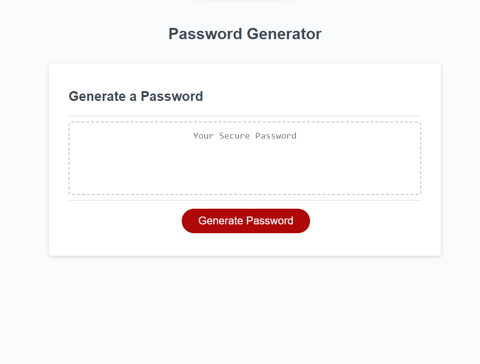
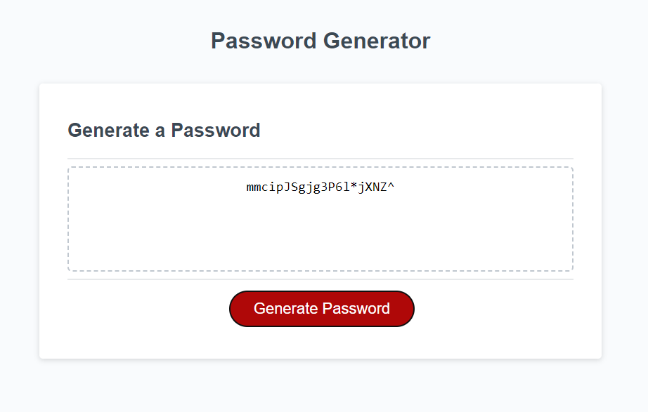

# Random Password Generator

## Description

The goal of this project is to create a random password generator that allows someone to generate an 8-128 character password using lowercase, uppercase, special, and numerical characters.

## Installation

N/A

## Usage

To use the generator, you must click on the red button labeled 'Generate Password'. Once you do that, several alert boxes will appear and you must answer each of them before a password can be generated. 

There are 5 questions to answer in total: 
- How long do you want the password to be? This can be a value anywhere between 8 and 128, if anything else is input, it will return an error message. 
- Do you want lowercase letters?
- Do you want uppercase letters?
- Do you want numbers?
- Do you want special characters?  

If no option is chosen between lowercase letters, uppercase letters, numbers, or special characters, and error will return.

The first image below shows what the generator should look like before a password is generated:
  

The second image shows what a generated password might look like:
 

## Credits

Thanks to Peyton Castillo who helped get me on the right track with pseudo code!   
And thanks to Marni Luka for helping me figure out how to concatenate the character arrays!
https://www.youtube.com/watch?v=x4HUaiazDes  
https://www.youtube.com/watch?v=O-79Cb5s9U4

## License

N/A